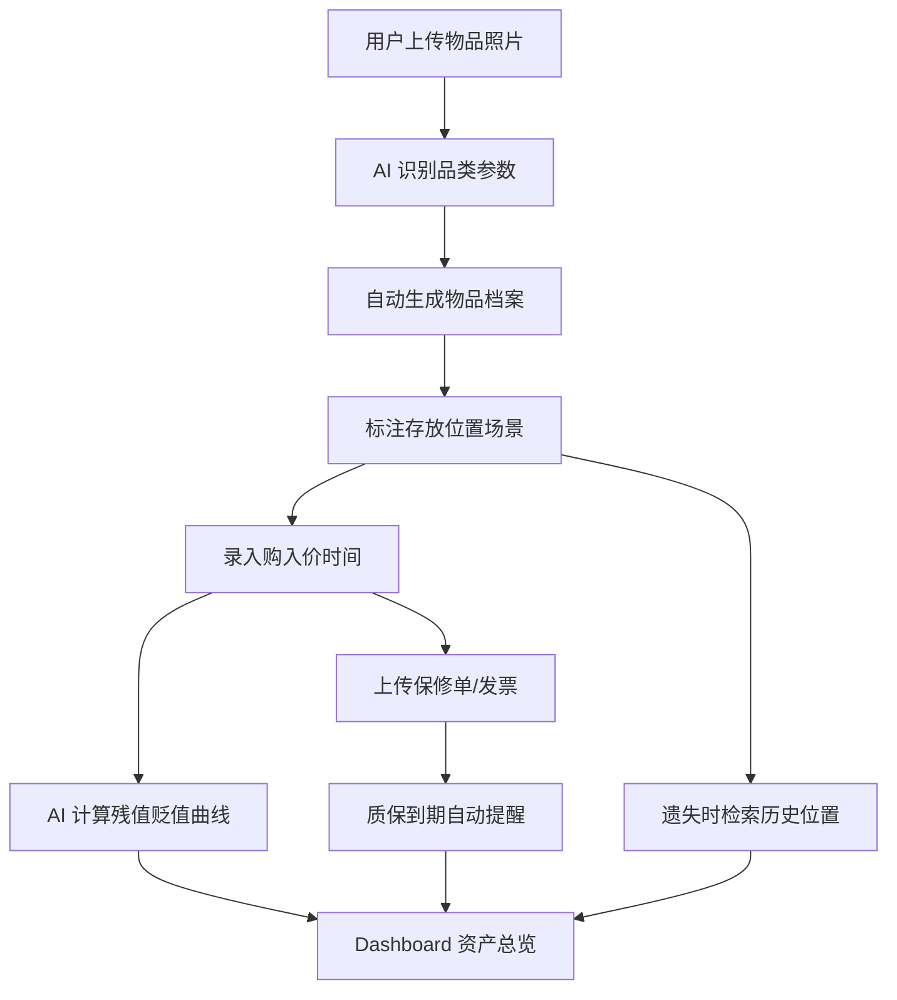

# 个人全生命周期物品记忆溯源与价值资产管理系统 - PRD

## 1. 产品概述

「拾忆 · 物语」是一款面向个人用户的轻量化物品全生命周期管理网页系统，融合 AI 物品识别建档、位置记忆溯源、资产残值动态评估、质保权益时效管理四大核心能力，填补记账软件、收纳工具、企业资管系统之间的功能断层。

- **核心痛点**：找不到、记不清、舍不得、断舍离难、错过质保
- **目标用户**：18-45 岁有家庭/独居收纳需求、关注理性消费、追求生活品质的普通用户
- **市场价值**：国内尚无「个人物品记忆 + 资产价值」一体化管理工具，差异化显著

## 2. 核心功能

### 2.1 用户角色
本产品为单角色 C 端工具，无需多角色权限区分。

### 2.2 功能模块
本次 HTML 创意原型聚焦**核心模块视觉化展示**，覆盖以下 5 大模块的完整闭环：

1. **首页 Dashboard**：资产总览看板 + 核心入口
2. **AI 智能建档**：拍照上传 → AI 识别 → 一键生成物品档案
3. **位置记忆溯源**：地图式房间视图 + 物品存放轨迹
4. **资产价值评估**：残值曲线 + 闲置等级 + 处置建议
5. **质保权益管理**：凭证归档 + 到期提醒

### 2.3 页面详情

| 页面名称 | 模块名称 | 功能描述 |
|---------|---------|---------|
| 顶部导航 | 品牌 Logo + 5 大模块入口 + 用户头像 | 全局导航 |
| 首页 Dashboard | 资产总价值卡片 / 物品数量 / 即将到期质保数 / 闲置告警数 | 核心数据一屏概览 |
| 首页 Dashboard | 品类分布饼图 / 残值趋势曲线 / 最近活动流 | 可视化图表 |
| AI 智能建档 | 拍照上传区 / 物品识别结果卡 / 字段自动填充 | 演示 AI 识别能力 |
| 位置记忆溯源 | 房屋平面图（房间 → 柜体 → 位置）/ 物品轨迹时间线 | 演示空间记忆 |
| 资产价值评估 | 物品残值卡片 / 贬值曲线图 / 闲置等级标签 / 处置建议 | 演示资产动态评估 |
| 质保权益管理 | 凭证列表 / 到期倒计时 / 弹窗提醒样式 | 演示质保管理 |
| 页脚 | 产品价值主张 + 参赛信息 | 强化产品定位 |

## 3. 核心流程

### 用户主流程：拍照建档 → 位置记录 → 价值追踪 → 质保管理

## 4. 用户界面设计

### 4.1 设计风格

- **品牌定位**：理性生活 × 温暖记忆 = 「博物馆档案室 × 生活杂志」双重气质
- **主色系**：
  - 主色：墨黑 `#1A1A1A`（理性、专业）
  - 辅色：米白 `#F5F1E8`（温暖、记忆）
  - 点缀：琥珀金 `#C8956D`（价值、品质）
  - 强调：朱砂红 `#C84B4B`（警示、提醒）
- **字体选择**：
  - 中文标题：思源宋体 / Noto Serif SC（古典、有记忆感）
  - 中文正文：思源黑体 / Noto Sans SC（清晰易读）
  - 数字 / 英文：Playfair Display（高级感）
- **布局风格**：卡片式 + 大量留白 + 杂志风栅格
- **图标风格**：线性图标（lucide 风格）+ 关键数据带手写体数字点缀
- **质感细节**：纸张纹理背景 / 标签贴纸感 / 老式打字机打字效果

### 4.2 页面设计概述

| 页面名称 | 模块名称 | UI 元素 |
|---------|---------|---------|
| 顶部导航 | Logo | 印章感红方块 + 「拾忆」二字宋体 + 英文 SUB.TAG |
| 首页 Dashboard | 资产总价值 | 巨型数字 + 货币符号 + 下方趋势小字 |
| 首页 Dashboard | 数据卡片 | 米白底 + 1px 描边 + 顶部装饰线条 |
| AI 智能建档 | 拍照区 | 虚线方框 + 中央相机图标 + 文字提示 |
| AI 智能建档 | 识别结果 | 物品照片缩略图 + 标签云 + 自动填充字段 |
| 位置记忆溯源 | 房屋平面图 | SVG 房间俯视图 + 物品热点标记 |
| 位置记忆溯源 | 轨迹时间线 | 左侧时间竖线 + 圆点节点 + 卡片 |
| 资产价值评估 | 残值曲线 | SVG 平滑曲线 + 关键节点标注 |
| 资产价值评估 | 闲置等级 | 4 档色阶（绿/黄/橙/红） |
| 质保权益管理 | 到期提醒 | 红框 + 倒计时 + 凭证缩略图 |
| 底部 | 价值主张 | 三栏式：「不再丢失」「不再浪费」「不再错过」 |

### 4.3 响应式

- **桌面优先**：1440px 设计基准，向下兼容至 1024px
- **原型阶段**：专注桌面端视觉冲击，不做移动端适配

### 4.4 3D 场景指引

不适用。本产品为信息管理工具，使用 SVG 矢量图 + CSS 动画即可达到视觉冲击。

## 5. 原型交付目标

- **文件形式**：单一 HTML 文件（含内联 CSS/JS），双击即开
- **交互深度**：静态展示为主，关键按钮具备 hover 效果
- **视觉目标**：体现差异化、品质感、记忆温度，通过初审视觉评审
