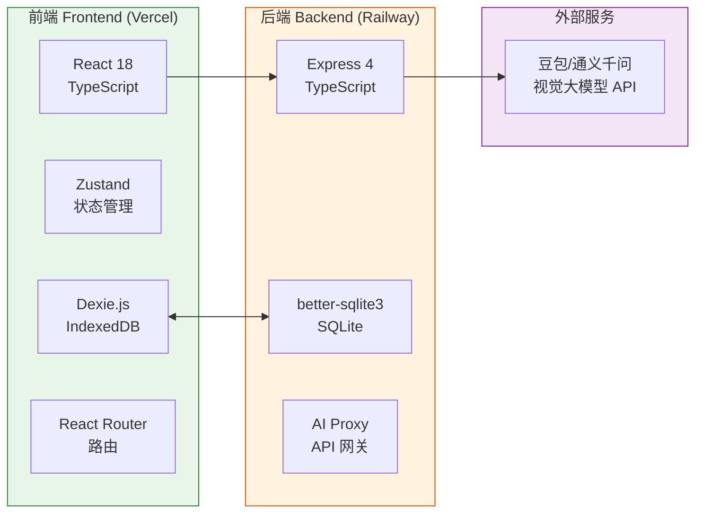

# 技术架构文档 · Technical Architecture

> 「拾忆 · 物语」移动端 Web App · 初赛 Demo 版本

---

## 1. 整体架构



---

## 2. 技术栈详情

### 前端
| 技术 | 版本 | 用途 |
|---|---|---|
| React | 18 | UI 框架 |
| TypeScript | 5 | 类型安全 |
| Vite | 5 | 构建工具 |
| Tailwind CSS | 3 | 原子化样式 |
| Zustand | 4 | 全局状态管理 |
| Dexie.js | 4 | IndexedDB 封装 |
| React Router | 6 | 路由管理 |
| Lucide React | latest | 图标库 |
| Recharts | 2 | 图表 |
| date-fns | 3 | 日期处理 |

### 后端
| 技术 | 版本 | 用途 |
|---|---|---|
| Express | 4 | HTTP 框架 |
| TypeScript | 5 | 类型安全 |
| better-sqlite3 | 9 | SQLite 数据库 |
| @doubao SDK / axios | - | AI API 调用 |
| multer | 1 | 文件上传 |
| cors | 2 | 跨域 |
| zod | 3 | 请求校验 |

---

## 3. API 设计

### 基础信息
- Base URL: `https://api.subtag.app`（Railway 部署后替换）
- Content-Type: `application/json`
- 所有响应统一包装：`{ success, data, error }`

### 3.1 AI 物品识别接口

**POST** `/api/ai/recognize`

Request（FormData）:
```
image: File (图片文件，multipart/form-data)
```

Response:
```json
{
  "success": true,
  "data": {
    "name": "索尼 WH-1000XM5",
    "category": "digital",
    "brand": "SONY",
    "confidence": 0.982,
    "tags": ["耳机", "降噪", "数码"],
    "estimatedPrice": 2800
  }
}
```

### 3.2 物品 CRUD

**GET** `/api/items` — 获取全部物品列表

**POST** `/api/items` — 新增物品
```json
{
  "name": "戴森 V12 吸尘器",
  "category": "appliance",
  "purchasePrice": 4990,
  "purchaseDate": "2023-12-15",
  "locationId": "loc_xxx",
  "warrantyEndDate": "2026-12-15"
}
```

**PUT** `/api/items/:id` — 更新物品

**DELETE** `/api/items/:id` — 删除物品

### 3.3 位置管理

**GET** `/api/locations` — 获取全部位置

**POST** `/api/locations` — 新增位置（房间/柜体）

**PUT** `/api/locations/:id` — 更新位置

**DELETE** `/api/locations/:id` — 删除位置

**GET** `/api/items/:id/history` — 获取某物品移动轨迹

### 3.4 质保管理

**GET** `/api/warranties/expiring` — 获取即将到期的质保（30天内）

### 3.5 数据备份

**GET** `/api/backup` — 导出全部数据 JSON

**POST** `/api/backup/import` — 导入数据

---

## 4. 数据模型（SQLite）

### 4.1 items 表
```sql
CREATE TABLE items (
  id TEXT PRIMARY KEY,
  name TEXT NOT NULL,
  category TEXT NOT NULL,
  brand TEXT,
  model TEXT,
  purchase_price INTEGER NOT NULL,  -- 单位：分，避免浮点
  purchase_date TEXT NOT NULL,       -- YYYY-MM-DD
  location_id TEXT,
  current_location TEXT,
  image_urls TEXT,                   -- JSON 数组
  warranty_end_date TEXT,
  warranty_document TEXT,
  notes TEXT,
  tags TEXT,                         -- JSON 数组
  created_at TEXT NOT NULL,
  updated_at TEXT NOT NULL
);
```

### 4.2 locations 表
```sql
CREATE TABLE locations (
  id TEXT PRIMARY KEY,
  name TEXT NOT NULL,
  parent_id TEXT,                    -- 父级位置（树形）
  level TEXT NOT NULL,               -- 'room' | 'cabinet' | 'position'
  sort_order INTEGER DEFAULT 0,
  created_at TEXT NOT NULL
);
```

### 4.3 location_history 表
```sql
CREATE TABLE location_history (
  id TEXT PRIMARY KEY,
  item_id TEXT NOT NULL,
  from_location_id TEXT,
  to_location_id TEXT NOT NULL,
  moved_at TEXT NOT NULL,
  note TEXT,
  FOREIGN KEY (item_id) REFERENCES items(id)
);
```

---

## 5. 前端路由结构

| 路径 | 页面 | Tab |
|---|---|---|
| `/` | 首页 Dashboard | 🏠 |
| `/search` | 物品搜索列表 | 🔍 |
| `/add` | AI 拍照建档 | ➕ |
| `/add/manual` | 手动录入 | - |
| `/location` | 位置地图 | 📍 |
| `/profile` | 个人中心 | ⚙️ |
| `/item/:id` | 物品详情 | - |
| `/item/:id/edit` | 编辑物品 | - |
| `/warranties` | 质保管理列表 | - |
| `/settings` | 设置页 | - |

---

## 6. 目录结构

```
trae-create/
├── frontend/                  # 前端项目
│   ├── src/
│   │   ├── components/
│   │   │   ├── ui/          # 基础组件
│   │   │   └── features/     # 业务组件
│   │   ├── pages/            # 页面
│   │   ├── hooks/            # 自定义 hooks
│   │   ├── store/            # Zustand store
│   │   ├── utils/            # 工具函数
│   │   ├── types/            # TS 类型
│   │   ├── api/              # API 请求封装
│   │   ├── styles/           # 全局样式
│   │   ├── App.tsx
│   │   └── main.tsx
│   └── package.json
│
├── backend/                  # 后端项目
│   ├── src/
│   │   ├── routes/           # 路由
│   │   ├── services/        # 业务逻辑
│   │   ├── middleware/      # 中间件
│   │   ├── db/              # SQLite 数据库
│   │   ├── ai/              # AI 识别服务
│   │   ├── types/           # TS 类型
│   │   └── index.ts         # 入口
│   └── package.json
│
├── .trae/documents/          # 项目文档
├── prototype/                # 原型文件（保留）
└── 个人全生命周期...Plan.md
```

---

## 7. 关键设计决策

### 7.1 价格存储：分而非元
避免浮点精度问题，所有金额在数据库中以**整数分**存储，UI 层做格式化转换。

### 7.2 AI 识别降级策略
- 优先调用真实 AI API
- 若 API 超时 10s → 自动降级到本地物品库关键词匹配
- 本地物品库预置 50+ 常见物品模板

### 7.3 离线优先策略
- 数据优先写 IndexedDB（用户立即感知）
- 后台异步同步到 SQLite 后端
- 离线时完整功能可用，在线时数据持久化

### 7.4 部署架构
- **前端**：Vercel（自动 HTTPS，CDN 加速）
- **后端**：Railway（自动 HTTPS，休眠策略节省额度）
- **域名**：Vercel 分配免费域名，或绑定自有域名
